# Dashwroom — F1 25 live telemetry dashboard (Android)

The phone or tablet listens directly for the UDP telemetry EA SPORTS F1® 25 broadcasts on the
local network — no PC bridge, no server. Kotlin, 100 % Jetpack Compose, Material 3, dark-first.
Supports packet format **2025** and the **2026 Season Pack** format (24 cars, overtake mode,
active aero), and ignores anything else gracefully.

## Quick start

1. Install the app on a device on the **same Wi-Fi** as your PC/PS5/Xbox (5 GHz recommended).
2. Open **Connect** (tap the status pill): it shows the device's IP in large type.
3. In F1 25 › Settings › Telemetry Settings: UDP Telemetry **On**, Broadcast **Off**,
   IP **= device IP**, Port **20777**, Send Rate **60 Hz**, Format **2025** (or **2026** with
   the 2026 Season Pack).
4. No game handy? Settings › Data source › **Mock** simulates a full 20-car race or a Q1
   session at 60 Hz with every packet type. **Replay** plays back sessions you recorded on the
   Connect screen.

## Screens

| | Phone | Tablet |
|---|---|---|
| **Drive** — what you look at while driving: rev lights, a huge gear (purple = shift), speed, clutch/brake/throttle bars, steering, throttle/brake trace, lap time and delta, DRS / lap-invalid flags. Presets: **Auto** (follows the session), **Race** (position, gaps, fuel, tyres, ERS), **Quali** (Δ PB + Δ session best, live sectors, time left), **Time trial** (big Δ PB, sectors, theoretical best), **Minimal**. Full-screen button hides all bars | 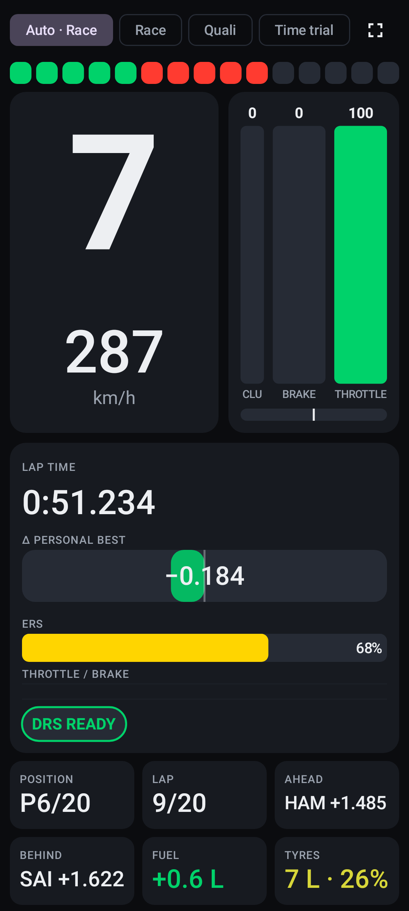 | 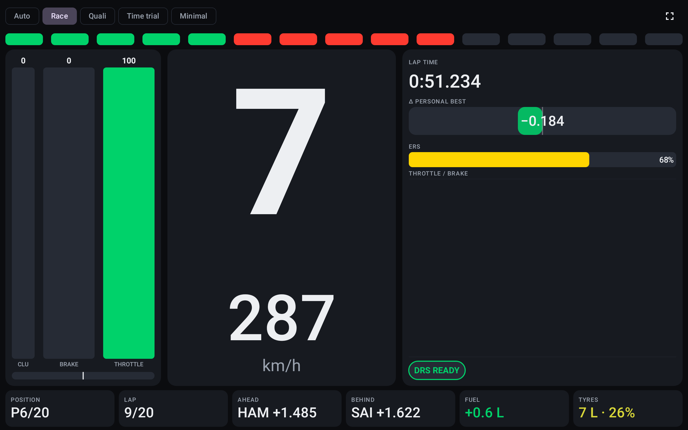 |
| **Drive** — Minimal preset (phone, landscape) and Quali preset (tablet) | 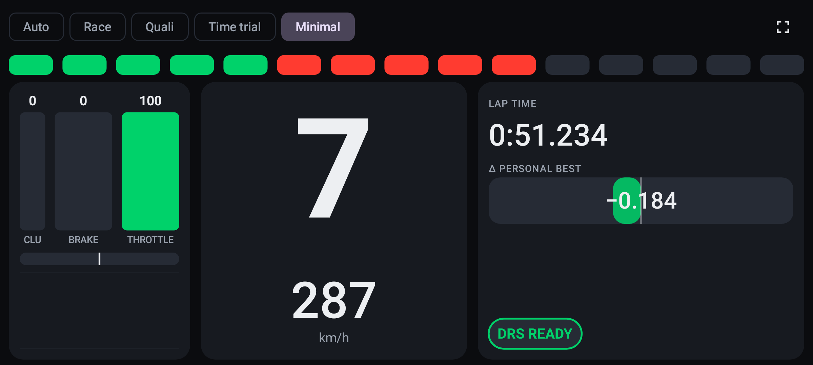 | 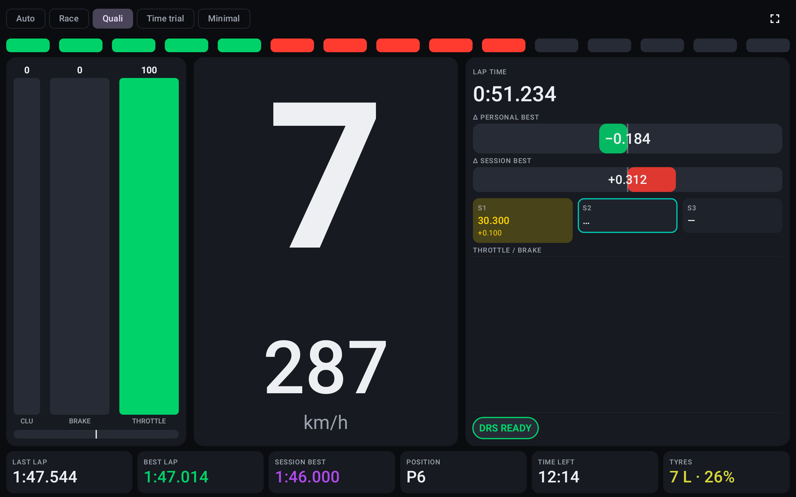 |
| **Overview** — session header, position and gaps, live delta bar, auto-scaled track map with every car, tyres, fuel, ERS, damage silhouette | 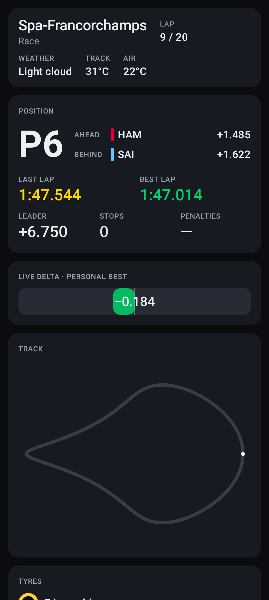 | 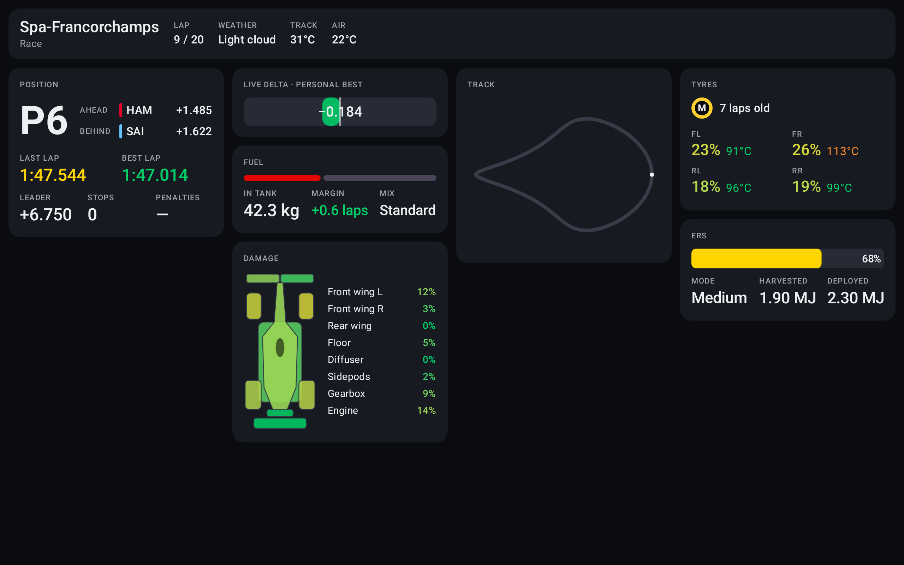 |
| **Race** — full-rate strip (rev LEDs, gear, speed, DRS, lap time, delta), timing tower (tyre + age, interval, gap, last/best, pit, penalties, DRS), race control, pit window / rejoin / undercut helper | 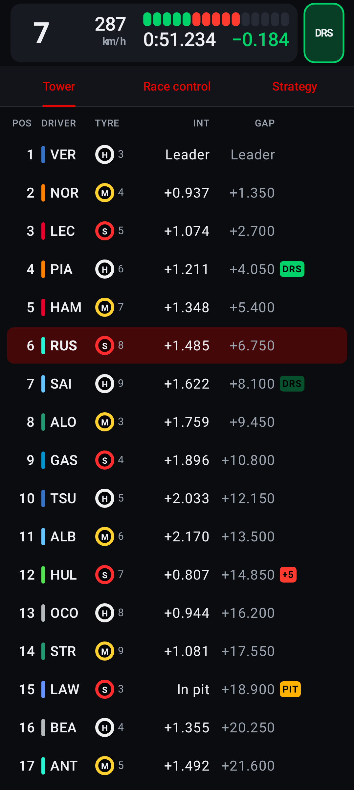 | 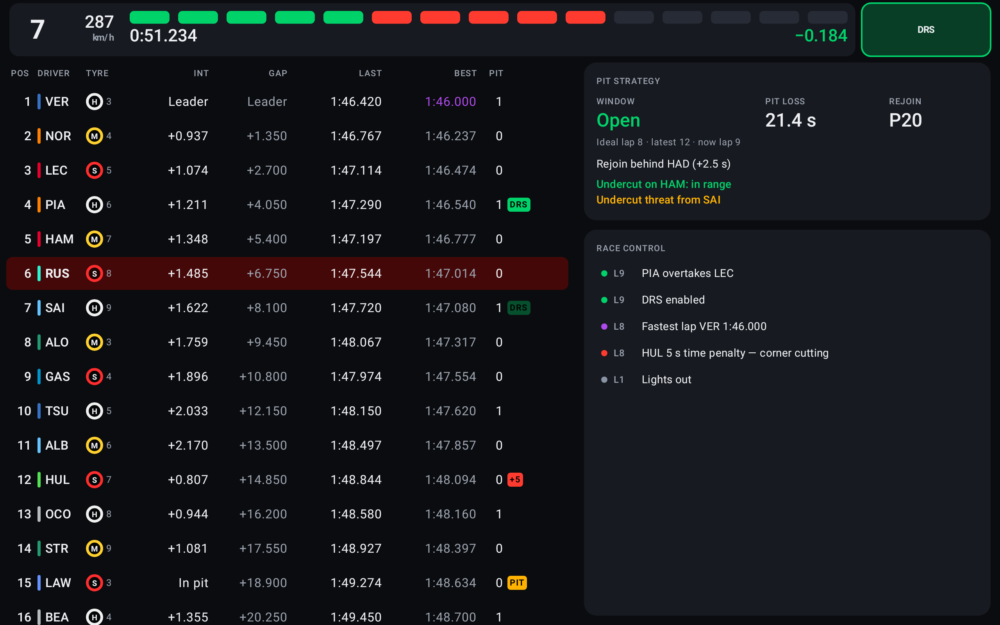 |
| **Race › driver** — sectors, stints, pit stops, lap times, position-by-lap chart (bottom sheet on phones, right pane on tablets) | | 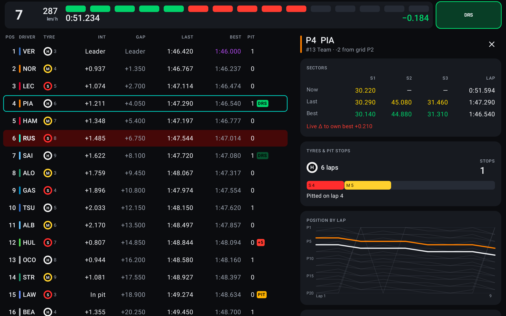 |
| **Qualifying** — leaderboard by best lap, purple/green sectors, cars on a flying lap with live sector deltas, Q1/Q2 knock-out line, live delta to PB and session best | 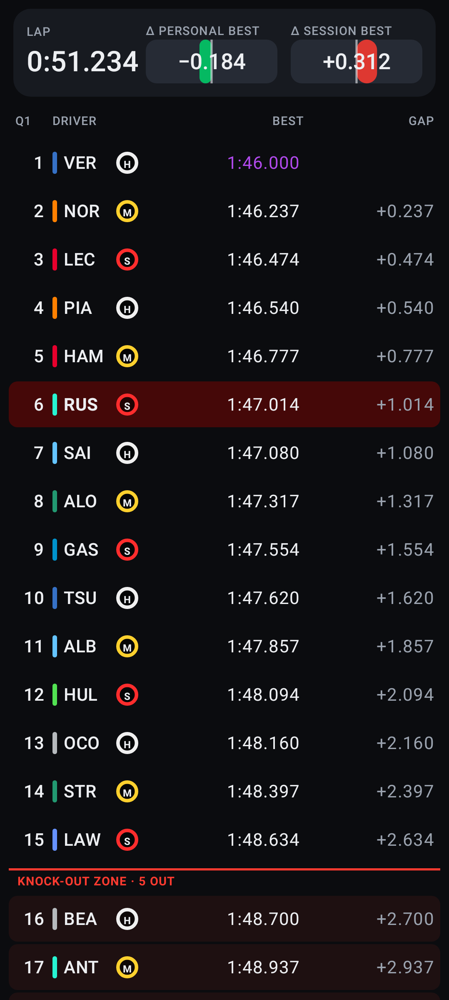 | 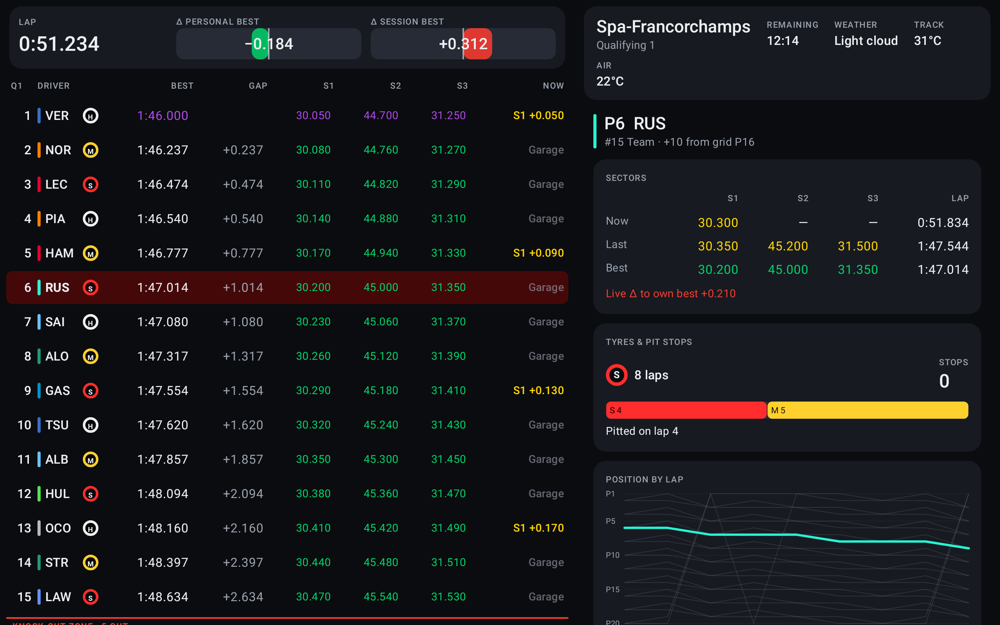 |
| **Car & Tyres** — surface + carcass heat map and brake temps on the car, pressures, wear, blisters, full damage and power-unit wear, tyre-set inventory | 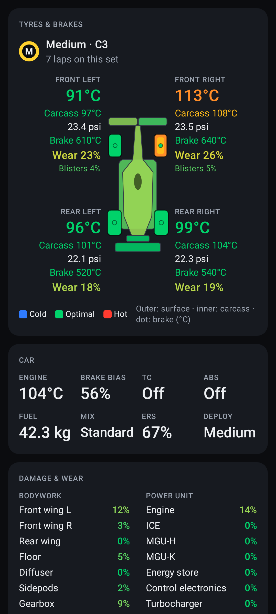 | 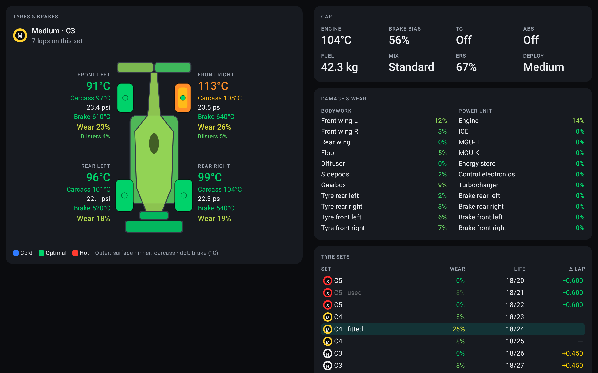 |
| **Lap Analysis** — speed/throttle/brake/gear/steering traces, overlay two laps with a running time delta, pinch-zoom + scrubbing crosshair, sector table; every lap is archived (Room) for cross-session comparison | 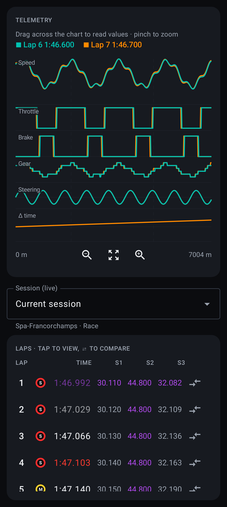 | 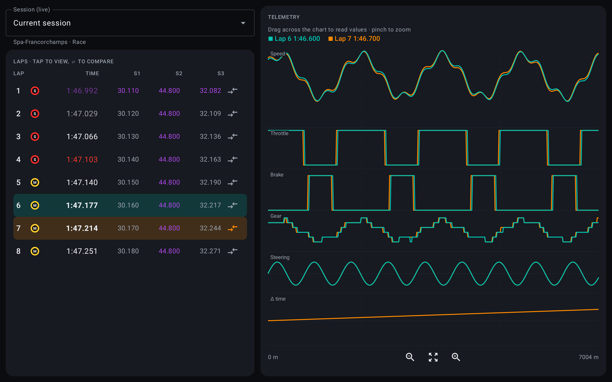 |
| **Connect** — IP, setup steps, live diagnostics (packets/s per type, loss, format, sender), recorder | 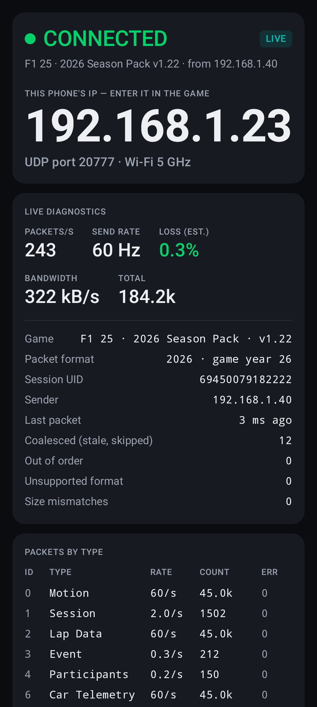 | 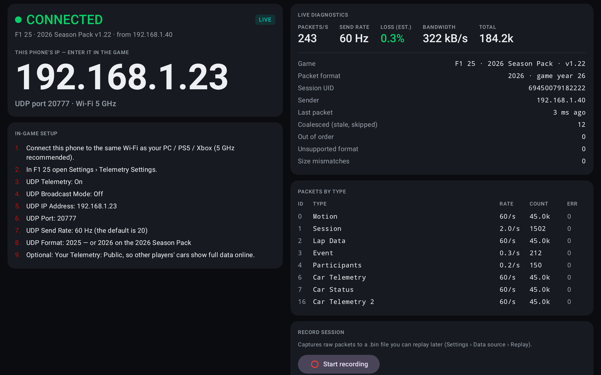 |
| **Foldable, tabletop posture** — live data on the upright half, tower on the flat half | | 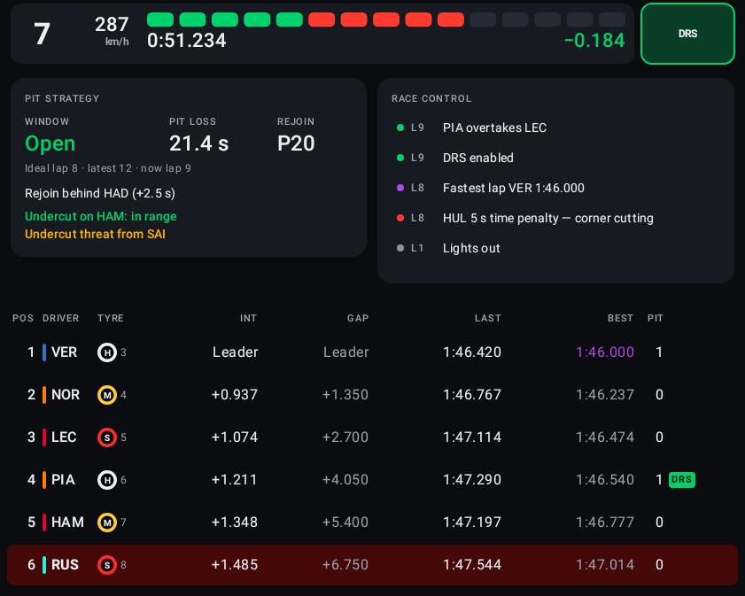 |

Settings: UDP port, theme, km/h–mph, °C–°F, UI density (compact / normal / large), keep screen
on, per-screen orientation lock, data source (live / mock race / mock qualifying / replay),
start on boot, delta reference lap (personal best / session best / last lap), debug HUD.

## Adaptive layout

* Navigation: bottom bar < 600 dp, rail 600–840 dp, drawer ≥ 840 dp
  (`NavigationSuiteScaffold`); content respects system-bar insets with every variant.
* List-detail screens (Race, Qualifying, Analysis, Car) share their composables; only the
  container changes — side by side on expanded windows, list + bottom sheet on phones.
* Foldables: folding features from Jetpack WindowManager (`windowPosture.hingeList`). A vertical
  separating hinge splits the panes exactly at the fold; a horizontal one (tabletop) stacks
  them above and below it. No pane width is hard-coded.
* All text is in `sp` and scales with the system font size and the density setting.
* Every screen has `@PreviewScreenSizes` + tablet previews and works in both orientations.

## Modules

| Module | What | Android? |
|---|---|---|
| `:core:telemetry` | Spec-exact parsers for all 17 packet types (2025 + 2026 layouts), encoder, ingest pipeline, `TelemetryRepository`, race/player/history models, lock-free `HotTelemetry` | plain Kotlin/JVM |
| `:replay` | `MockTelemetryEmitter` (procedural circuit, race + qualifying simulation), `.bin` recorder/replayer | plain Kotlin/JVM |
| `:app` | Compose UI, Hilt, DataStore settings, Room lap archive, foreground `UdpTelemetryService`, allocation-free `OsUdpSource` | Android |
| `:benchmark:jmh` | Parser/ingest microbenchmarks | JVM |
| `:benchmark:macro` | Macrobenchmarks (startup; frame timing on Race, Overview, Qualifying, Connect) + Baseline Profile generator | Android test |

The official EA UDP specifications this is built from are in [`docs/spec/`](docs/spec/); every
parser documents its byte offsets against them.

## Data flow and rendering

```
socket (drain burst) ─▶ IngestStats ─▶ [recorder tap] ─▶ coalescer (newest per type)
   ─▶ PacketParser (reused objects) ─▶ TelemetryStore ─┬▶ HotTelemetry (volatile fields, read per frame in draw)
                                                        ├▶ StateFlows: session, race, player, history, events (≤ 10 Hz, on change)
                                                        └▶ track outline, lap traces ─▶ LapArchive (Room)
TelemetryRepository.status: StateFlow<TelemetryStatus> (4 Hz diagnostics, SEARCHING/CONNECTED/STALE)
```

* Ingest runs on one dedicated thread and allocates nothing per packet.
* Frame-driven UI: `rememberHotFrame` checks `HotTelemetry.version` once per display frame
  (60/90/120 Hz) and bumps a single state that is read **only inside draw lambdas**. Speed,
  gear, rev LEDs, lap time, deltas and ERS redraw at panel rate with no recomposition, drawing
  pre-measured glyphs (no strings or text layouts per frame). When data stops, the loop backs
  off and stops requesting frames.
* Track-map positions interpolate between the last two 60 Hz motion samples for smooth motion
  on 90/120 Hz panels.
* Cold data (tower, tyres, damage) is immutable, rebuilt at ≤ 10 Hz only on change; the tower
  is a keyed `LazyColumn` with `animateItem` and a draw-phase flash on position changes.

## Build, test, benchmark

```bash
./gradlew assembleDebug                 # or assembleRelease (R8 + shrinking + baseline profile)
./gradlew test                          # 121 JVM tests: parsers, pipeline, mock, replay, Room, Robolectric UI
./gradlew :app:recordRoborazziDebug     # re-render app/screenshots/*.png
./gradlew :benchmark:jmh:jmh            # parser microbenchmarks (see docs/benchmarks/PHASE1.md)
scripts/run-device-benchmarks.sh        # macrobenchmarks + baseline profile (needs a device)
```

Requires JDK 17+ and Android SDK platform 37 (compileSdk 37; targetSdk 36; minSdk 26).

Tests include golden byte-offset checks against the spec, round trips for every packet in both
formats, fuzzed/truncated input, zero-allocation assertions on the hot path, a UDP loopback
integration test, full mock races through the domain model, Room DAO/codec tests, foldable
hinge-split layout tests, accessibility checks (every clickable labelled, ≥ 48 dp targets),
Roborazzi screenshots of every screen on phone and tablet, and a Hilt end-to-end test from the
mock emitter to the Connect screen.

**On-device only** (not runnable in CI without hardware): the Macrobenchmark frame-timing
acceptance (0 janky frames, P99 < 16 ms over 30 s with the 60 Hz mock on the Race screen) and
Baseline Profile generation — run `scripts/run-device-benchmarks.sh` with a device on adb.
In debug builds JankStats logs janky frames per screen, and the debug HUD (Settings) shows
packets/s, fps, latency, dropped frames and allocation rate.
